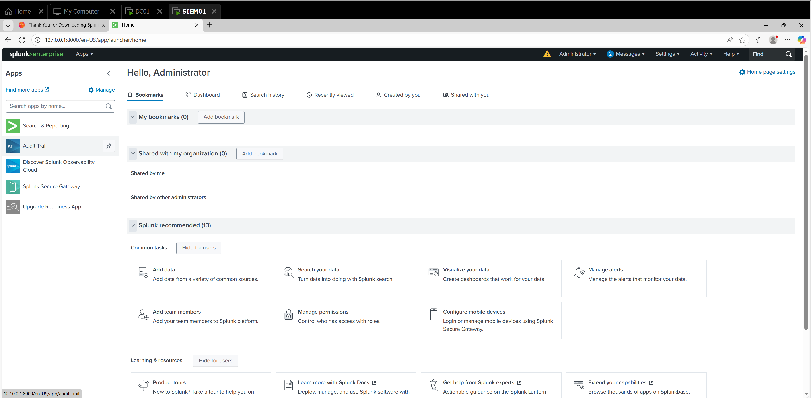
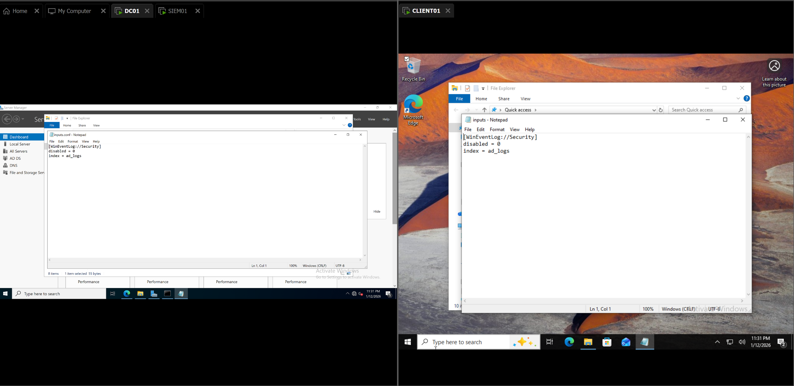
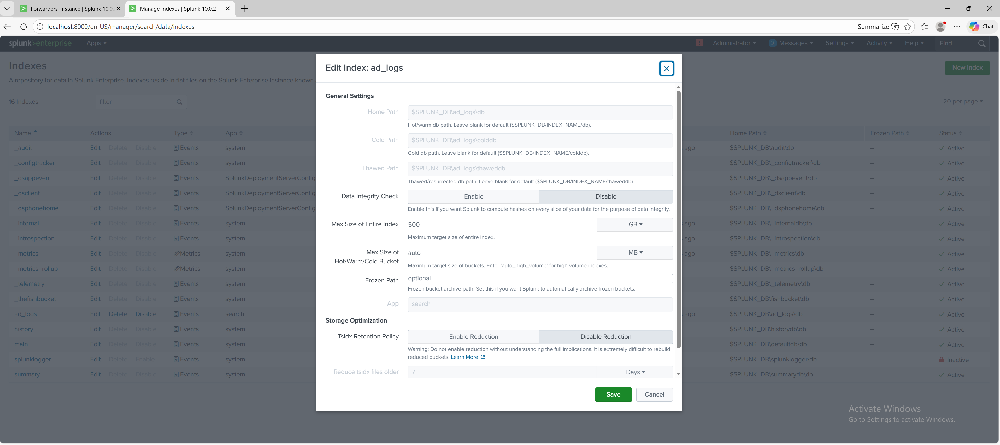
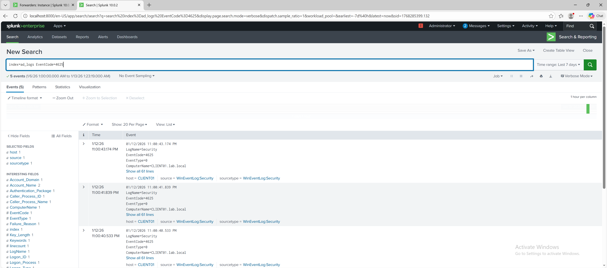
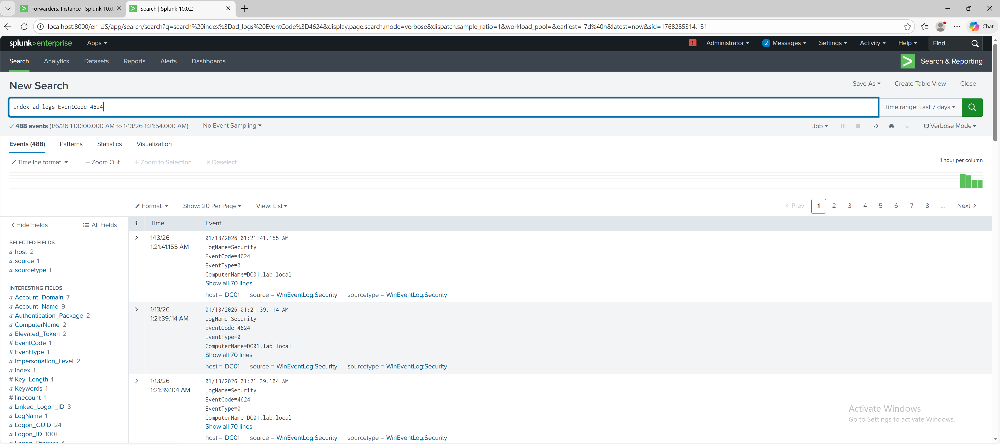
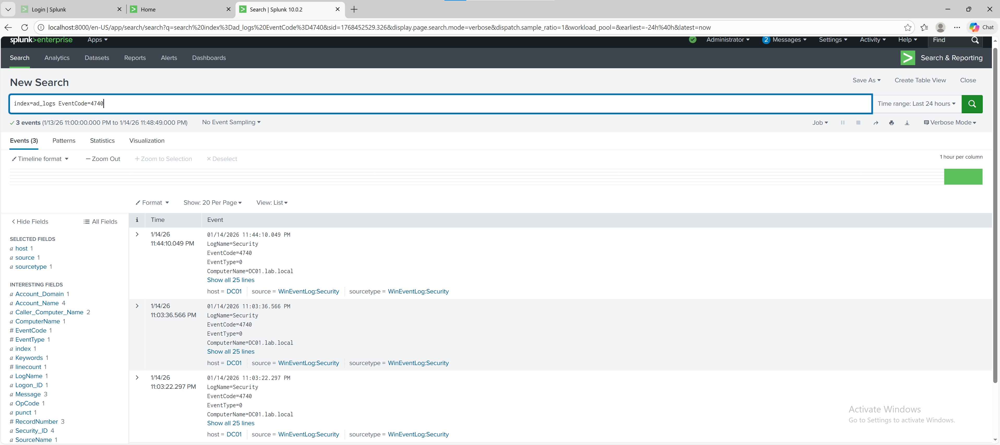
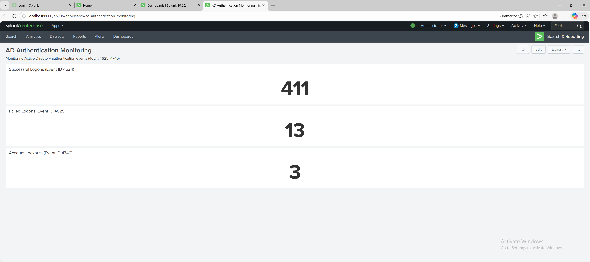
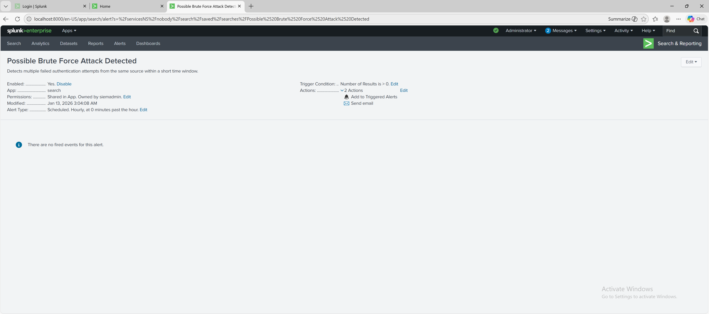

# Splunk SIEM Lab – Active Directory Monitoring

## 📌 Project Overview
This lab demonstrates the deployment of Splunk Enterprise to monitor an Active Directory environment. The lab focuses on collecting Windows Event Logs from domain controllers and clients, detecting failed logins, account lockouts, and brute-force attempts, and visualizing authentication events through dashboards.

---

## 🧰 Technologies Used
- Splunk Enterprise
- Windows Server 2022 (Domain Controller)
- Windows 10 (Domain Client)
- Active Directory Event Logs
- PowerShell
- VMware Workstation Pro

---

## 🔧 Configuration Steps

### 1️⃣ Splunk Installation and Login
- Installed Splunk Enterprise on SIEM01 VM
- Logged in with admin credentials

*Splunk Enterprise login page on SIEM01.*

---

### 2️⃣ Add Data Inputs
- Configured Splunk to monitor Windows Event Logs from DC01 and CLIENT01
- Collected Security and System logs

*Adding Windows Event Logs as a data input for monitoring.*

---

### 3️⃣ Index Creation
- Created a dedicated index `ad_logs` for Active Directory events
- Ensures events are separated for easier searching and reporting

*Shows creation of the 'ad_logs' index in Splunk.*

---

### 4️⃣ Security Event Searches
- Searched for key AD authentication events:

#### Failed Logons (Event ID 4625)

*Splunk search results showing failed logon attempts.*

#### Successful Logons (Event ID 4624)

*Splunk search results showing successful user logons.*

#### Account Lockouts (Event ID 4740)

*Splunk search results showing account lockouts and source systems.*

---

### 5️⃣ Dashboard Creation
- Created `AD_Authentication_Monitor` dashboard
- Added panels for:
  - Failed Logons
  - Successful Logons
  - Account Lockouts

*Displays the dashboard with three panels for authentication events.*

---

### 6️⃣ Alert Configuration (Optional)
- Created a search-based alert for failed logons >5 in 10 minutes
- Configured notification options (email/pop-up)

*Shows alert setup for brute-force detection.*

---

### 7️⃣ Lab Verification / Testing
- Conducted real-world tests to ensure monitoring works:

#### Account Lockout

*Triggered an account lockout to verify Event ID 4740 captured in Splunk.*

#### Failed Logons

*Performed failed logon attempts to verify Event ID 4625 captured.*

#### Successful Logons

*Verified successful authentication events (Event ID 4624) in Splunk.*

---

## 🎯 Skills Demonstrated
- Splunk Enterprise installation and configuration
- Windows Event Log collection and indexing
- Creation of Splunk searches for security monitoring
- Dashboard design for AD authentication events
- Alert configuration for account security
- Analysis of authentication patterns and suspicious behavior

---

## 🚀 Future Improvements
- Integrate additional data sources (Sysmon, IIS logs)
- Correlate multiple events for advanced attack detection
- Build custom alert workflows for automated response
- Expand dashboards for network-wide visibility

---

## 🧠 Author
**Quincy Bryant**  
Entry-Level Cybersecurity / SOC Analyst Candidate

